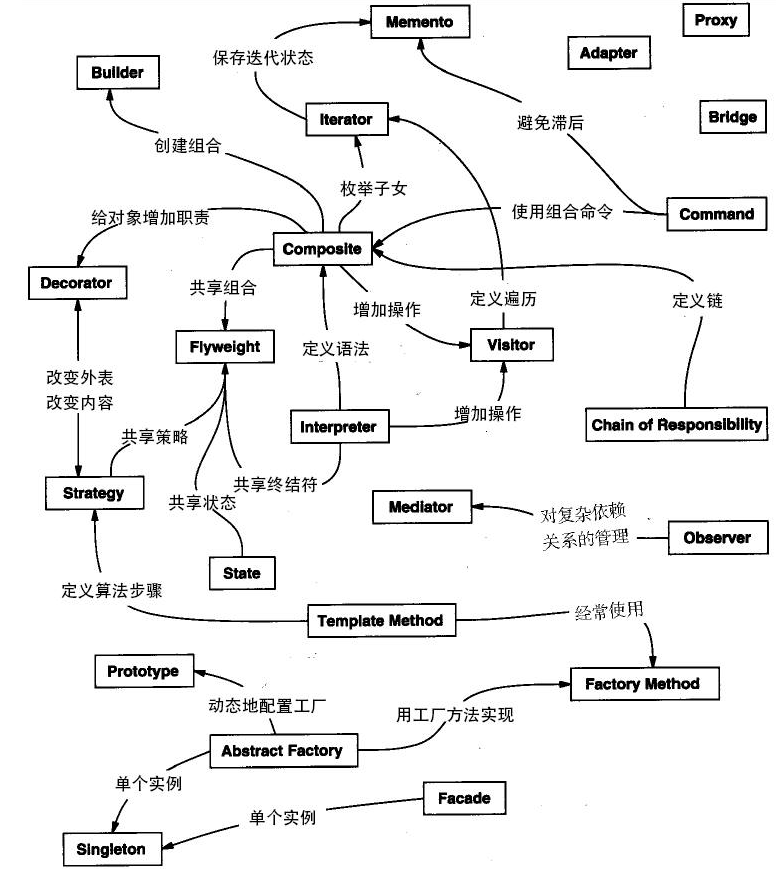

##设计模式适用场景

###创建型
- 工厂模式、抽象工厂模式、工厂方法模式、静态工厂模式(Factory)
    > 关注于对象的创建
- 单例模式、多例模式(Singleton/Multiton)
- 建造者模式(Builder)
    > 关注于复杂对象的组装
- 原型模式(Prototype)
- 对象池模式(Pool)

###结构型
- 适配器模式(Adapter)
    > 当新增逻辑与现有逻辑相似但是参数不同时，做出入参适配
- 桥接模式(Bridge)
- 过滤器模式(Filter)
- 组合模式(Composite)
- 装饰器模式(Decorator)
- 外观模式(Facade)
- 享元模式(Flyweight)
- 代理模式(Proxy)
    > 在被代理的方法执行前后做一些额外的动作，如打印日志，统计执行耗时
- 数据映射模式(Data Mapper)
- 流接口模式(Fluent Interface)
- 注册模式(Registry)

###行为型
- 职责链模式(Chain of Responsibility)
    > 关注于业务职责的一整套链路，如Web的过滤器链、审批链
- 命令模式(Command)
- 解释器模式(Interpreter)
- 迭代器模式(Iterator)
- 中介者模式(Mediator)
- 备忘录模式(Memento)
- 观察者模式(Observer)
    > 发布/订阅模式，将订阅者列表保存起来，当发布新事件时，遍历挨个通知
- 状态模式(State)
    > 多个状态转换的状态机，如订单状态转换、审批流状态转换
- 空对象模式(Null Object)
    > 主要用于省去了对象判断的麻烦，可以与策略模式结合使用
- 策略模式(Strategy)
    > 传入不同的参数选择不同的实现类
- 模板模式(Template)
    > 抽象类中集成了业务规则的模板，把具体的细节留给子类实现
- 访问者模式(Visitor)
- 规格模式(Sepcification)

###J2EE设计模式(关注于表示层)
- MVC模式(MVC)
- 业务代表模式(Business Delegate)
- 组合实体模式(Composite Entity)
- 数据访问对象模式(Data Access Object)
- 前端控制器模式(Front Controller)
- 拦截过滤器模式(Intercepting Filter)
- 服务定位器模式(Service Locator)
- 传输对象模式(Transfer Object)
- 委托模式(Delegation)
- 资源库模式(Repository)

###六大设计原则
 ##### 单一职责原则(SRP):
 - 只有一个原因能引起类或方法的改变；即一个类或者方法只应该做一件事；
 - 类的职责划分在业务逻辑上保持单一，从而能够使类得到复用
 
 ##### 里氏替换原则(LSP):
 - 能使用父类的地方，必然能够使用子类，反之则不成立；既子类必须完整的实现父类的方法
 - 如果子类不能完整的实现父类的方法或者父类的某些方法在子类中发生了畸变，则建议断开父子继承关系，采用依赖、聚集、组合等关系代替继承；
 
 ##### 依赖倒置原则(DIP):
 - 高层模块不应该依赖于底层模块，两者都应该依赖于抽象；
 - 抽象不应该依赖于细节：抽象类不应该依赖于具体的实现类
 - 细节应该依赖于抽象；
 
 ##### 接口隔离原则(ISP)：
 - 类间的依赖关系应该建立在最小的接口上，既接口应该尽量的小，一个接口只服务于一个子模块或者业务逻辑
 
 ##### 迪米特法则(LOD)：
 - 一个类应该尽可能少的与其它实体相互作用
 - 实践：引入一个合理的第三者降低现有对象之间的耦合度
  
 ##### 开闭原则(OCP)：
 - 对扩展开放，对修改关闭；即软件尽量在不修改原有代码的基础上进行扩展
 - 实践：需求在变化时，重新定义新的实现类而不是修改接口或者抽象方法，从而达到尽量减少代码修改的目的

